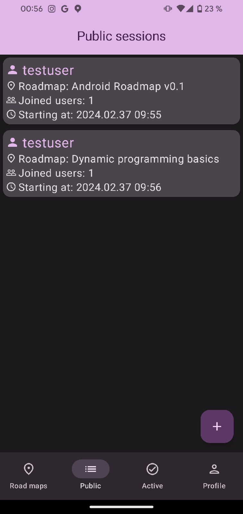

# Comapr [WIP]

This projects aims to bring new cooperative way to study to your phone.

## Features: 
* Choose any available roadmap to study
* Cooperate with your friends: create studying session and study roadmap together (complete tasks on your own and see the progress of your study-buddies)
* Communicate right in the app
* Create roadmaps! Community will be glad to check it out and rate your work
* Improve your stats

## Screenshots
 
 

## Stack/other info
* Jetpack compose + Material3
* Kotlin+concurrency
* Retrofit
* Room
* Clean architecture
* Dagger-hilt 

## Backend
Backend was written on Spring+Kotlin. 
[Github repository link](https://github.com/Snow4DV/comapr-backend)
